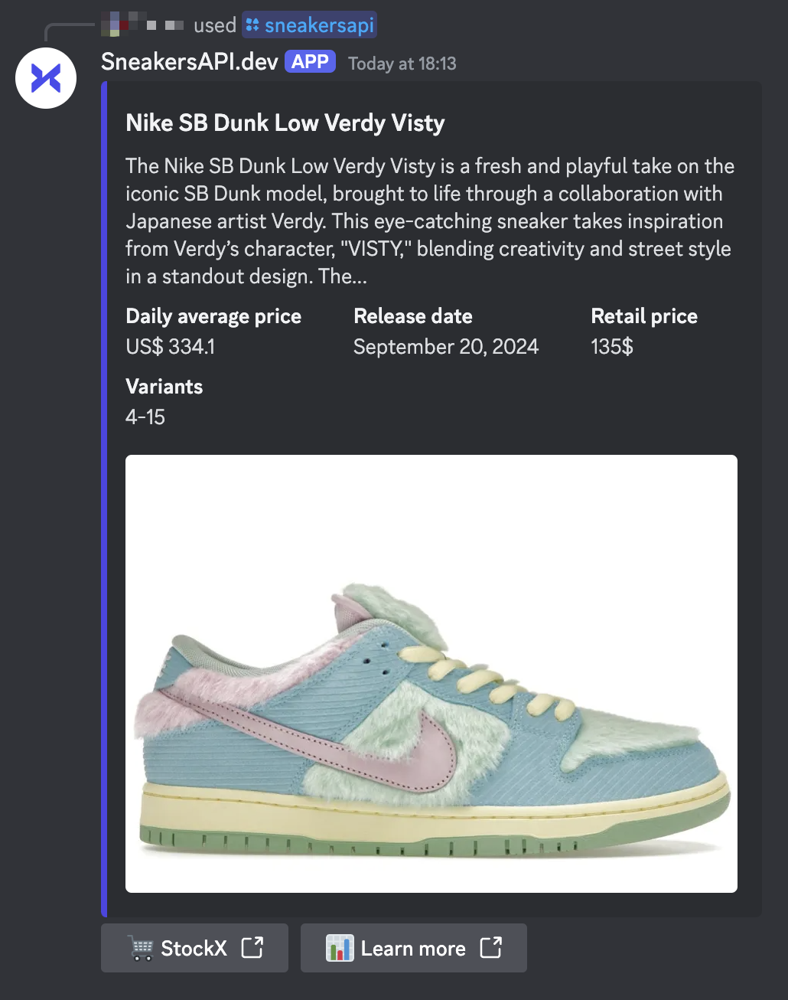

# Sneakers Discord Bot

A simple and performant Discord bot that allows you to search for sneakers, fashion and collectibles items directly from Discord. This bot is built for [Deno Deploy](https://deno.com/deploy) and based on [SneakersAPI.dev](https://sneakersapi.dev) for the search.

## Use the hosted version

A free hosted version of the bot is available, you can invite it on your server using the following link:

[
](https://discord.com/oauth2/authorize?client_id=1302343127549481122&integration_type=0&scope=applications.commands)

## Screenshot

Example of a search for `/sneakersapi SB Dunk Verdy`:


## Run your own version

Before running your own version, be sure to have a Discord application created with:

- Discord Bot Token
- Discord Client ID or Application ID
- Discord Public Key

This discord bot is built for [Deno Deploy](https://deno.com/deploy), you can deploy your own version using the following command:

```bash
# Clone the repository
git clone https://github.com/vlourme/sneakers-discord-bot && cd sneakers-discord-bot

# Fill the .env file with your Discord credentials
cp .env.example .env

# Register the command on Discord
./register.sh
```

Then you should login on Deno Deploy and add this repository (forked) as a new project or eventually just copy the `main.ts` in the playground.

**Important:**

- Don't forget to set `DISCORD_PUBLIC_KEY` environment variable on Deno Deploy, only this one is required.
- Once the bot is deployed, set the deployed URL as **Interaction Endpoint URL** in your Discord application.

To invite the bot, you should go on Discord Developer Portal, select your application and then go on OAuth2, enable the `applications.commands` scope under bot permissions and you should be able to invite the bot on your server.

## Change the command name

If you want to change the command name, you should update the `name` field in the `register.sh` file.

# License

This project is licensed under the MIT License. See the [LICENSE](LICENSE) file for details.
